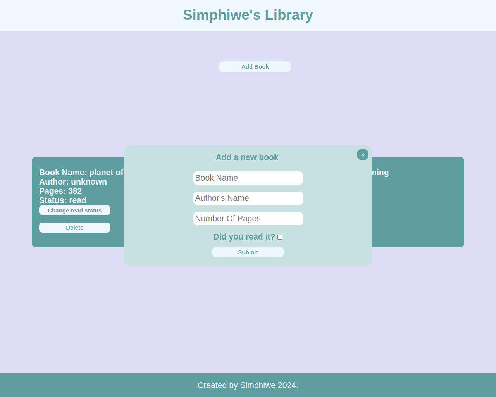

# **Library**

Check it _**LIVE**_ 👉
**<https://deebest.github.io/library/>**

This is a library web app where a user can add their favorite books, it is a project I built for the Odin project curriculum where I am learning the full stack web development.

## Features

- User can add books
- User can mark books as read or not
- User can delete the books

## Tech stack used

- GIT
- HTML
- CSS
- JavaScript

## Contact

Get in touch:

Email : **<simphiwedladla8@gmail.com>**

Linked: **<https://www.linkedin.com/in/dladla-simphiwe-89061a20a/>**

Github: **<https://github.com/DeeBest>**
